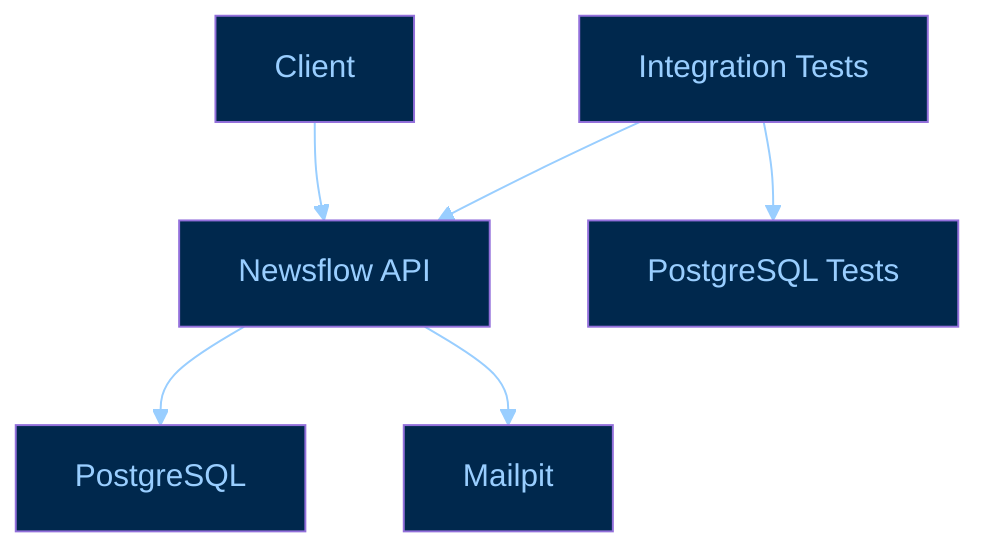

# Newsflow API

O Newsflow é uma API de gestão editorial voltada para portfólios, desenvolvida com ASP.NET Core e PostgreSQL, que conta com autenticação, permissões baseadas em funções, gestão de equipe, ativação de conta via convite, testes de integração e infraestrutura de desenvolvimento conteinerizada com Docker.

O objetivo do projeto é fornecer uma base sólida para a construção de um CMS completo, com foco em segurança, escalabilidade e boas práticas de desenvolvimento, simulando um ambiente de produção realista para desenvolvimento e testes.

> **Status:** em desenvolvimento
> A branch `dev` representa o estado mais atual do projeto.
> A branch `main` representa a versão estável do projeto.

---

# Stack

| Tecnologia                           | Utilização                                      |
| ------------------------------------ | ----------------------------------------------- |
| **C#**                               | Linguagem principal                             |
| **.NET 10**                          | Runtime e framework                             |
| **ASP.NET Core**                     | Web API                                         |
| **ASP.NET Core Identity**            | Gerenciamento de identidade e autenticação      |
| **Entity Framework Core 10**         | ORM                                             |
| **PostgreSQL 18**                    | Banco de dados                                  |
| **Npgsql**                           | Provider PostgreSQL para EF Core                |
| **FluentValidation**                 | Validação dos requests                          |
| **MailKit**                          | Envio de e-mails                                |
| **Docker / Docker Compose**          | Ambiente de desenvolvimento e testes            |
| **Redis 8**                          | Serviço de infraestrutura preparado no ambiente |
| **xUnit v3**                         | Testes                                          |
| **Microsoft.AspNetCore.Mvc.Testing** | Testes de integração                            |
| **Microsoft Testing Platform**       | Execução dos testes                             |

---

## Infraestrutura da aplicação



---

## Funcionalidades atuais

### ✉️ Convites

* Criação de usuários inicialmente em estado `Pending`
* Geração de tokens de convite
* Codificação segura do token para utilização em URLs
* Envio de convite por e-mail
* Aceitação do convite
* Definição da senha durante a ativação
* Confirmação automática do e-mail após aceitação
* Transição do usuário de `Pending` para `Active`
* Validação de tokens inválidos

### Autenticação

* Login com e-mail e senha
* Logout
* Autenticação baseada em cookie HTTP
* Endpoint para obter informações do usuário autenticado
* Alteração de senha
* Solicitação de recuperação de senha
* Redefinição de senha através de token
* Bloqueio após múltiplas tentativas de login
* Expiração e sliding expiration do cookie
* Invalidação de sessão através de Security Stamp

### Autorização

* Roles
* Permissions
* Relação `User ↔ Role`
* Relação `Role ↔ Permission`
* Policies do ASP.NET Core
* Claims customizadas
* Atualização das claims após alterações de roles
* Invalidação de sessões quando as roles do usuário são alteradas

### Testes de integração

A API possui uma suíte de testes de integração executada contra um PostgreSQL dedicado para testes.

Os testes cobrem, entre outros:

* autenticação de usuários
* login inválido
* login válido
* sessão autenticada
* criação de usuários
* prevenção de usuários duplicados
* alteração de senha
* recuperação de senha
* redefinição de senha
* autorização baseada em permissions
* criação de Staff
* Staff duplicado
* gerenciamento de roles
* invalidação de sessão após remoção de role
* geração de convite
* aceitação de convite
* tokens de convite inválidos

Os testes utilizam `WebApplicationFactory` e substituem o serviço de e-mail real por um `MockEmailService`.

---

# Executando o projeto

## Pré-requisitos

É necessário ter instalado:

* Docker
* Docker Compose
* Git

Para desenvolvimento local fora do Docker, também é necessário o SDK do .NET 10.

A versão do SDK utilizada pelo projeto está definida em:

```text
global.json
```

Atualmente:

```text
.NET SDK 10.0.400
```

---

## 1. Clone o repositório

```bash
git clone https://github.com/leonardooliveira00/newsflow-api.git
cd newsflow-api
```

---

## 2. Crie o arquivo `.env`

O arquivo `.env` é ignorado pelo Git porque contém configurações que podem incluir credenciais.

Um exemplo para desenvolvimento local utilizando o Mailpit:

```env
NEWSFLOW_DEV_ADMIN_PASSWORD=Admin@123456

Email__Host=mailpit
Email__Port=1025
Email__UseTls=false
Email__UseAuthentication=false
Email__SenderEmail=no-reply@newsflow.local
Email__SenderName=Newsflow

Frontend__InvitationTokenUrl=http://localhost:3001/invitation
Frontend__ResetPasswordUrl=http://localhost:3001/reset-password
```

> O valor de `NEWSFLOW_DEV_ADMIN_PASSWORD` deve ser definido localmente e não deve ser versionado.

---

## 3. Suba os serviços

```bash
docker compose up --build
```

A API ficará disponível em:

```text
http://localhost:3000
```

O PostgreSQL ficará disponível em:

```text
localhost:5432
```

O Redis:

```text
localhost:6379
```

O Mailpit:

```text
http://localhost:8025
```

---

# Usuários de desenvolvimento

Quando executada no ambiente `Development`, a aplicação realiza seed dos dados estruturais e cria usuários necessários para desenvolvimento.

O seed cria inicialmente Staffs de desenvolvimento, incluindo:

```text
admin@newsflow.com
reporter@newsflow.com
```

O usuário administrador recebe a role:

```text
ADMIN
```

A senha do administrador é obtida através da configuração:

```text
DevelopmentAdmin__Password
```

que, no Docker Compose, é alimentada por:

```text
NEWSFLOW_DEV_ADMIN_PASSWORD
```

---

# Banco de dados e migrations

As migrations do Entity Framework Core ficam em:

```text
src/NewsflowApi/Infrastructure/Persistence/Data/Migrations/
```

O projeto possui o `dotnet-ef` como ferramenta local.

Para restaurar as ferramentas:

```bash
dotnet tool restore
```

Para criar uma migration:

```bash
dotnet ef migrations add MigrationName \
  --project src/NewsflowApi \
  --startup-project src/NewsflowApi
```

Para aplicar migrations manualmente:

```bash
dotnet ef database update \
  --project src/NewsflowApi \
  --startup-project src/NewsflowApi
```

Em `Development` e `Testing`, a aplicação também executa:

```csharp
context.Database.Migrate();
```

durante a inicialização.

---

# Seed de dados

O seed estrutural é dividido em etapas:

```text
StructuralSeeder
      │
      ├── RoleSeeder
      │
      ├── PermissionSeeder
      │
      └── RolePermissionSeeder
```

Os seeders são idempotentes: registros existentes são identificados antes da inserção.

No ambiente de desenvolvimento existe ainda:

```text
DevelopmentSeeder
```

responsável pelo bootstrap dos dados necessários para desenvolvimento.

---

# Roadmap

O projeto ainda está em desenvolvimento.

Próximas etapas planejadas incluem a expansão do CMS para contemplar o fluxo editorial completo.

---

## Licença

Este projeto está sendo desenvolvido como projeto de portfólio.

Consulte o repositório para informações atualizadas sobre licenciamento e utilização.
